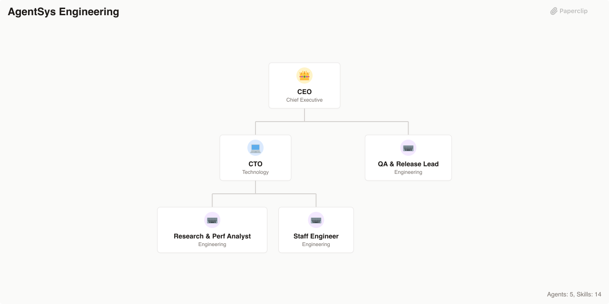

# AgentSys Engineering

> AI-powered software engineering company that orchestrates the full development lifecycle — from task discovery through production shipping

> An [Agent Company](https://agentcompanies.io) based on [agentsys](https://github.com/agent-sh/agentsys) — agent orchestration tooling for the full software development lifecycle with consultation, validation, and repo intelligence skills



## What's Inside

> This is an [Agent Company](https://agentcompanies.io) package from [Paperclip](https://paperclip.ing)

| Content | Count |
|---------|-------|
| Agents | 5 |
| Skills | 14 |

### Agents

| Agent | Role | Reports To |
|-------|------|------------|
| CEO | CEO | — |
| CTO | CTO | ceo |
| QA & Release Lead | Engineer | ceo |
| Research & Perf Analyst | Engineer | cto |
| Staff Engineer | Engineer | cto |

### Skills

| Skill | Description | Source |
|-------|-------------|--------|
| consult | Cross-tool AI consultation — get second opinions from Gemini CLI, Codex CLI, Claude Code, OpenCode, or Copilot CLI | [github](https://github.com/agent-sh/agentsys/blob/main/.kiro/skills/consult/SKILL.md) |
| debate | Structured multi-round debate between AI tools with proposer/challenger roles and verdict | [github](https://github.com/agent-sh/agentsys/blob/main/.kiro/skills/debate/SKILL.md) |
| deslop | Clean AI slop from code with certainty-based findings and auto-fixes | [github](https://github.com/agent-sh/agentsys/blob/main/.kiro/skills/deslop/SKILL.md) |
| discover-tasks | Discovers and ranks tasks from GitHub, GitLab, local files, and custom sources | [github](https://github.com/agent-sh/agentsys/blob/main/.kiro/skills/discover-tasks/SKILL.md) |
| drift-analysis | Analyze project state, detect plan drift, and create prioritized reconstruction plans | [github](https://github.com/agent-sh/agentsys/blob/main/.kiro/skills/drift-analysis/SKILL.md) |
| enhance-orchestrator | Coordinate multiple enhancement analyzers in parallel and produce unified report | [github](https://github.com/agent-sh/agentsys/blob/main/.kiro/skills/enhance-orchestrator/SKILL.md) |
| enhance-prompts | Analyze prompts for clarity, structure, examples, and output reliability | [github](https://github.com/agent-sh/agentsys/blob/main/.kiro/skills/enhance-prompts/SKILL.md) |
| learn | Research any topic online and create comprehensive learning guides with RAG-optimized indexes | [github](https://github.com/agent-sh/agentsys/blob/main/.kiro/skills/learn/SKILL.md) |
| orchestrate-review | Multi-pass code review orchestration with parallel reviewers for quality, security, performance, and test coverage | [github](https://github.com/agent-sh/agentsys/blob/main/.kiro/skills/orchestrate-review/SKILL.md) |
| perf-analyzer | Synthesize performance findings into evidence-backed recommendations and decisions | [github](https://github.com/agent-sh/agentsys/blob/main/.kiro/skills/perf-analyzer/SKILL.md) |
| perf-benchmarker | Run sequential performance benchmarks with strict duration rules and baseline management | [github](https://github.com/agent-sh/agentsys/blob/main/.kiro/skills/perf-benchmarker/SKILL.md) |
| repo-intel | Unified static analysis — git history, AST symbols, project metadata | [github](https://github.com/agent-sh/agentsys/blob/main/.kiro/skills/repo-intel/SKILL.md) |
| sync-docs | Sync documentation with code — find outdated refs, update CHANGELOG, flag stale examples | [github](https://github.com/agent-sh/agentsys/blob/main/.kiro/skills/sync-docs/SKILL.md) |
| validate-delivery | Autonomously validate that a task is complete and ready to ship — tests, build, and requirement checks | [github](https://github.com/agent-sh/agentsys/blob/main/.kiro/skills/validate-delivery/SKILL.md) |

## Getting Started

```bash
npx paperclipai company import this-github-url-or-folder
```

See [Paperclip](https://paperclip.ing) for more information.

## Runtime Configuration

After importing this company into Paperclip, configure heartbeat triggers in the UI:

| Agent | Timer Heartbeat | Wake on Assignment | Wake on Mention |
|-------|-----------------|-------------------|-----------------|
| Heartbeat Dispatcher | ✅ ON (every 5 min) | optional | optional |
| CEO | ❌ OFF | ✅ ON | ✅ ON |
| CTO | ❌ OFF | ✅ ON | ✅ ON |
| Staff Engineer | ❌ OFF | ✅ ON | ✅ ON |
| QA & Release Lead | ❌ OFF | ✅ ON | ✅ ON |
| Research & Perf Analyst | ❌ OFF | ✅ ON | ✅ ON |

**Why:** Timer heartbeats on idle agents burn 2–5K tokens per empty wake. The
Heartbeat Dispatcher is the only agent that needs a timer — it scans for stalled
work and nudges agents only when there's something to push. All other agents
wake only when there's actual work for them.

---
Exported from [Paperclip](https://paperclip.ing) on 2026-03-23
